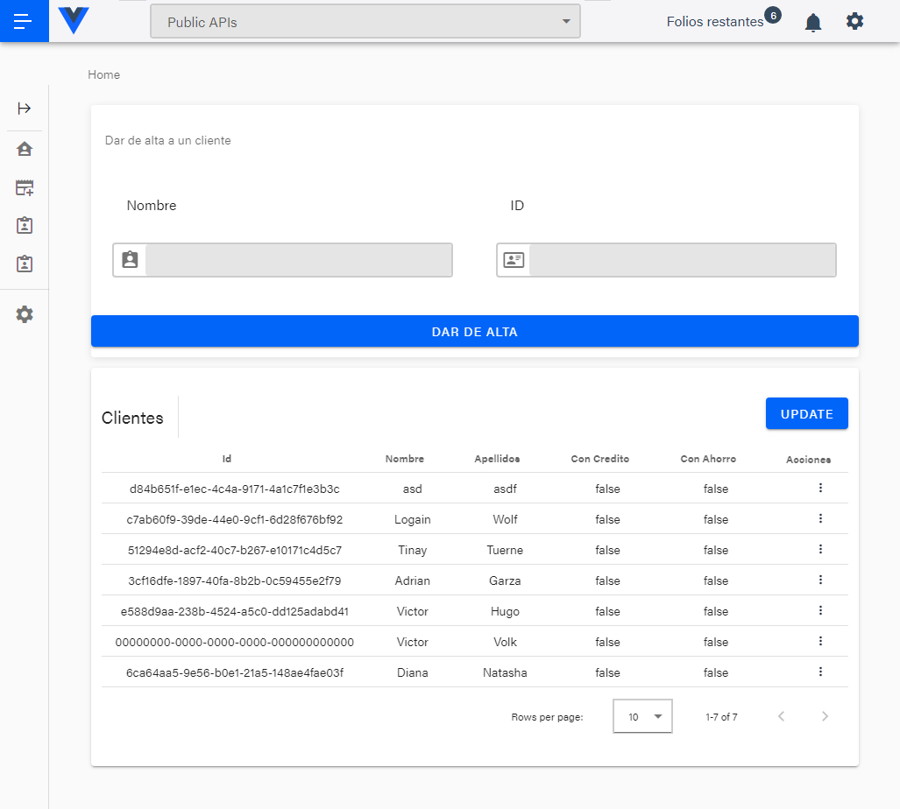

# parcelservice-frontend
Frontend prototype: credit and savings abstraction

## Project setup
```
yarn install
```

### Compiles and hot-reloads for development
```
yarn serve
```

### Compiles and minifies for production
```
yarn build
```

### Lints and fixes files
```
yarn lint
```

### Customize configuration
See [Configuration Reference](https://cli.vuejs.org/config/).


### Screenshot




### Links
- Solution URL: [https://github.com/ikreuz](https://github.com/ikreuz/parcelservice-frontend)
- Live Site URL: [https://vercel.com](https://credit-service.vercel.app)
- 

## My process

work in progress

### Built with

- Vue js 2.0
- Vuetify
- 
### What I learned

## Author

- Website - [Victor Cruz](https://github.com/ikreuz/)


